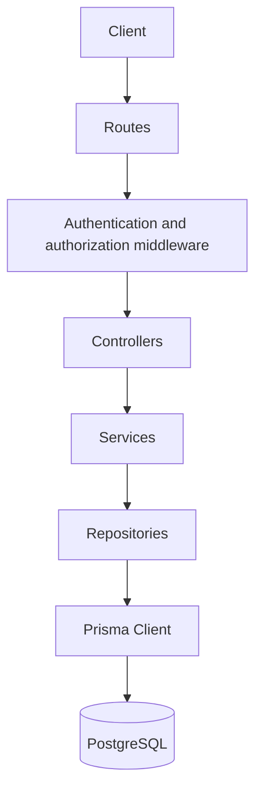
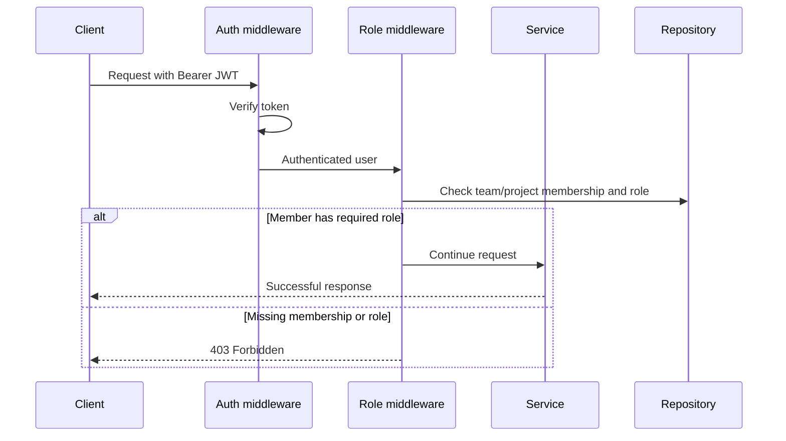
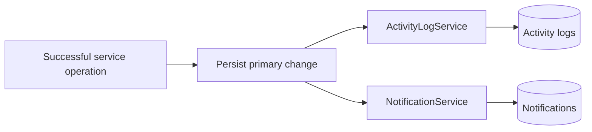

# Architecture

TeamFlow uses a layered architecture to keep HTTP concerns, business rules, and database access independent. This makes features easier to test, prevents route handlers from becoming large, and provides clear places for future infrastructure work.

## Layer responsibilities

| Layer | Responsibility |
| --- | --- |
| Routes | Map HTTP methods and paths to middleware and controllers. |
| Middleware | Authenticate JWTs and enforce team or project roles before protected work runs. |
| Controllers | Validate request input, invoke one service operation, and format HTTP responses. |
| Services | Apply business rules, coordinate repositories, and emit activity and notification events after successful operations. |
| Repositories | Perform Prisma database reads and writes only; they do not decide permissions. |
| Prisma | Maps typed application data to PostgreSQL tables and migrations. |

## Why this structure

Business rules such as “only an OWNER or ADMIN may assign a task” belong in services because they are independent of Express and reusable across request paths. Repositories stay database-only, so they can be substituted or mocked in service tests without needing an HTTP server or database connection.

Controllers remain deliberately thin. They translate a request into validated input and translate a service result or error into an HTTP response. This keeps the public API stable while allowing internal behavior to evolve.

## Authorization flow

Team membership is the foundation of authorization. Project and task access is resolved through the project’s team, ensuring that a user outside the team cannot view or modify its collaboration data.

## Activity logs

Activity logs are persisted records of significant team events such as project creation, task changes, assignments, and comment actions. Feature services create these records only after the primary business operation succeeds.

This produces an auditable history without putting logging code in controllers or repositories. Team members can read team activity newest first and can filter it by entity type or action.

## Notifications

Notifications are database-backed and independent from activity logs. Both are emitted from successful service operations, rather than one system reading the other system’s database table.

The current notification events are task assignment, a comment on an assigned task, and task completion by someone other than the creator. Each notification is scoped to its recipient; users can only list and mark their own notifications as read.

## Related diagrams

- [System architecture](diagrams/system-architecture.md)
- [Database relationships](diagrams/database-relationships.md)
- [Request flow](diagrams/request-flow.md)
