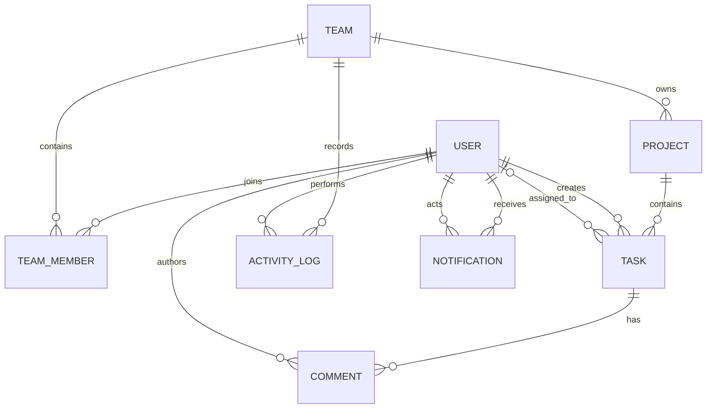

# Database relationships

```mermaid
erDiagram
  USER ||--o{ TEAM_MEMBER : joins
  TEAM ||--o{ TEAM_MEMBER : contains
  TEAM ||--o{ PROJECT : owns
  PROJECT ||--o{ TASK : contains
  USER ||--o{ TASK : creates
  USER o|--o{ TASK : assigned_to
  TASK ||--o{ COMMENT : has
  USER ||--o{ COMMENT : authors
  TEAM ||--o{ ACTIVITY_LOG : records
  USER ||--o{ ACTIVITY_LOG : performs
  USER ||--o{ NOTIFICATION : receives
  USER ||--o{ NOTIFICATION : acts
```

The authorization boundary is the team membership. Projects, tasks, and comments inherit access from the team that owns the associated project.
