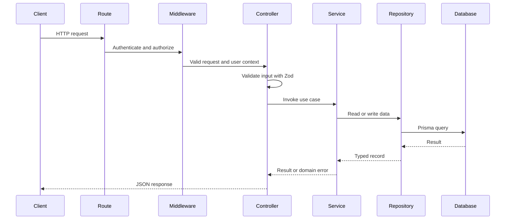

# Request flow

```mermaid
sequenceDiagram
  participant Client
  participant Route
  participant Middleware
  participant Controller
  participant Service
  participant Repository
  participant Database

  Client->>Route: HTTP request
  Route->>Middleware: Authenticate and authorize
  Middleware->>Controller: Valid request and user context
  Controller->>Controller: Validate input with Zod
  Controller->>Service: Invoke use case
  Service->>Repository: Read or write data
  Repository->>Database: Prisma query
  Database-->>Repository: Result
  Repository-->>Service: Typed record
  Service-->>Controller: Result or domain error
  Controller-->>Client: JSON response
```

The same flow applies across TeamFlow modules. Services may additionally persist an activity entry or notification after the primary operation has succeeded.
