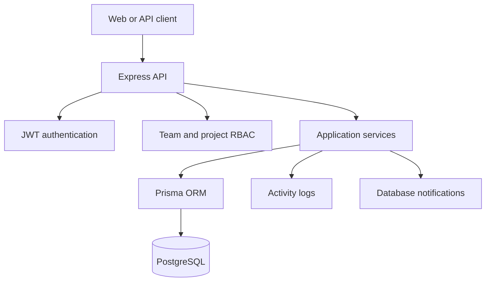

# System architecture

```mermaid
flowchart TB
  Client[Web or API client] --> API[Express API]
  API --> Auth[JWT authentication]
  API --> RBAC[Team and project RBAC]
  API --> Services[Application services]
  Services --> Prisma[Prisma ORM]
  Prisma --> Postgres[(PostgreSQL)]
  Services --> Activity[Activity logs]
  Services --> Notifications[Database notifications]
```

This is the current MVP architecture. Redis, a reverse proxy, CI, and cloud infrastructure are planned production additions rather than current dependencies.
